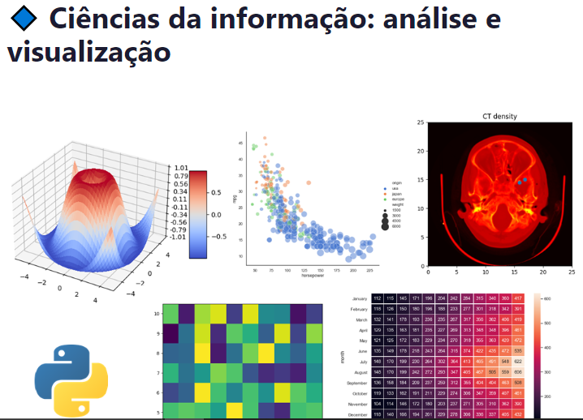
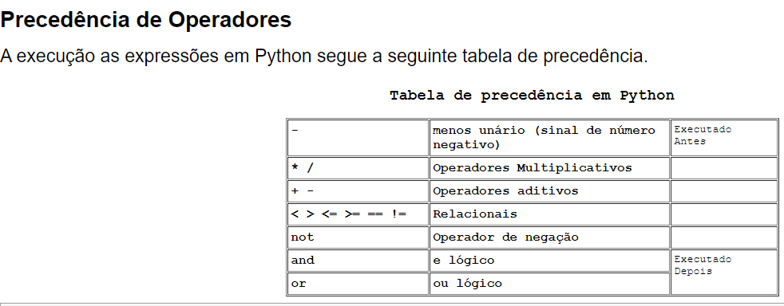
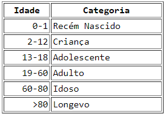

- [Introdução](#introdução)
- [Pra que serve o Python?](#pra-que-serve-o-python)
- [Tipos de variáveis e sintaxe básica](#tipos-de-variáveis-e-sintaxe-básica)
  - [Matemática](#matemática)
  - [Álgebra Booleana](#álgebra-booleana)
    - [Ordem de execução](#ordem-de-execução)
- [Introdução à biblioteca `math`](#introdução-à-biblioteca-math)
- [Introdução à biblioteca `random`](#introdução-à-biblioteca-random)
- [Manipulação de string](#manipulação-de-string)
- [Condicionais](#condicionais)
- [Loop](#loop)
  - [For](#for)
  - [While](#while)
    - [While True](#while-true)
  - [break](#break)
  - [continue](#continue)
  - [For aninhado](#for-aninhado)
  - [Mistura de for's e while's](#mistura-de-fors-e-whiles)
- [Estruturas compostas](#estruturas-compostas)
  - [Tuplas](#tuplas)
  - [Listas](#listas)
    - [Modificação](#modificação)
      - [Adição](#adição)
      - [Deleção](#deleção)
    - [Ponteiro](#ponteiro)
    - [Enumerate](#enumerate)
    - [Zip](#zip)
    - [Ordenação](#ordenação)
    - [Busca](#busca)
    - [List comprehension](#list-comprehension)
    - [Listas de listas(Matrizes)](#listas-de-listasmatrizes)
  - [Dicionários](#dicionários)
    - [Criação](#criação)
    - [Operação](#operação)
    - [Métodos](#métodos)
    - [Loops](#loops)
    - [Dict comprehension](#dict-comprehension)
  - [Set](#set)
  - [Métodos](#métodos-1)
- [Funções](#funções)
  - [Escopo](#escopo)
  - [Multiplos parâmetros](#multiplos-parâmetros)
  - [Return](#return)
  - [Valores Default e argumentos opcionais](#valores-default-e-argumentos-opcionais)
  - [Tipagem e docstring](#tipagem-e-docstring)
  - [Funções com \*args](#funções-com-args)
  - [Funções com \*\*kwargs](#funções-com-kwargs)
- [Manipulação de arquivos](#manipulação-de-arquivos)
  - [Write modes](#write-modes)
  - [Arquivos](#arquivos)
    - [txt](#txt)
    - [csv](#csv)
    - [json](#json)
    - [excel(apenas citar)](#excelapenas-citar)
    - [Binary files](#binary-files)
  - [Open \& with open](#open--with-open)
- [Tratamento de erro e exceção](#tratamento-de-erro-e-exceção)
- [Lambda](#lambda)
  - [Reduce](#reduce)
  - [Filter](#filter)
  - [All \& Any](#all--any)
- [Opcionais](#opcionais)
  - [Intermediário](#intermediário)
  - [Avançado](#avançado)
- [Classes](#classes)
  - [Definição](#definição)
  - [self](#self)
  - [Interação entre objetos](#interação-entre-objetos)
  - [init](#init)
  - [Exemplos](#exemplos)
  - [Dunders](#dunders)
  - [Inheritance](#inheritance)
  - [Decorators](#decorators)
    - [@staticmethod](#staticmethod)
    - [@property](#property)
    - [@classmethod](#classmethod)
- [API](#api)
  - [Métodos HTTP](#métodos-http)

# Introdução
_Conhecer o time e experiências: Background de curso, experiência de trabalho, langs, inglês, de onde é, o que já viu de Py_
# [Pra que serve o Python?](https://www.freecodecamp.org/portuguese/news/para-que-serve-o-python-mais-de-10-casos-de-utilizacao-da-linguagem-de-programacao-python/)

- Linguagem interpretada.
- Pode ser utilizado em terminal, script ou notebook.
- Linguagem de alto nível, portanto mais lenta que C.
- Não é fortemente tipado.
- Orientado a objetos.
- "Fácil" de escrever e compreender.

1. Análise de dados
2. Automatização (arquivos, fluxos de trabalho)
3. Gráficos
4. Joguinhos
5. Inteligência Artifical
6. Redes Neurais
7. Visão Computacional
8. Robótica
9. API
10. Backend
# Tipos de variáveis e sintaxe básica
1. `type()`
2. `int`, `float`, `bool`, `string`
3. `input()`
4. `print()`
## Matemática
+,-,*,**,/,//,%

> 1. Leia três números reais e imprima a média dos três
> 2. Leia um valor de temperatura expresso na escala Celsius e imprima a mesma em graus Fahrenheit. OBS: F = (9/5) * C + 32
## Álgebra Booleana
_Realizar perguntas de teste_
1. Métodos e operações de bool
2. Comparadores (>,<,==,!=)
### [Ordem de execução](https://www.inf.pucrs.br/pinho/PCB/ComandosDeDecisao/Decisao.htm)

# Introdução à biblioteca `math`
`round()`
# Introdução à biblioteca `random`
1. `randint()`
2. `random()`
3. `seed()`
4. 
# Manipulação de string

1. print detalhado
2. f-string
3. Operações
4. Methods (replace, isany, count, len, index,upper,lower,find)
5. operador in
6. slices

> Faça um programa que leia uma frase pelo teclado e mostre quantas vezes aparece a letra "A", em que posição ela aparece a primeira vez e em que posição ela aparece a última vez.

# Condicionais
1. If
2. Else
3. If aninhado
4. Elif
5. Curiosidades com outros elementos na condição

Exercícios

> 1. Escreva um programa que leia a idade e classifique como na tabela abaixo
> 

> 2. Leia duas notas de um aluno, do tipo float, calcule a média e imprima:
> • Aprovado, se média maior ou igual a 7 e menor ou igual a 10;
> • Recuperação, se média maior ou igual a 5 e menor que 7;
> • Reprovado, se média maior ou igual a 0 (zero) e menor que 5.

# Loop
## For
Syntaxe e utilizações
1. Input
2. If
3. Inverso

Introdução ao `time.sleep()` para o exercício
> Escreva um programa que simula uma contagem regressiva de 10 até 0 com atraso(sleep) e imprima "Boom!" ao final

> Escrever um programa que gera e escreve os números ímpares entre 100 e 200. (Demonstrar diversos meios de fazer)

## While
Casos de uso, como input
Utilização com limite de loop indefinido

> Construir um programa que calcule a média aritmética de vários valores inteiros positivos, lidos externamente. O final da leitura acontecerá quando for lido um valor negativo

> Leia um número inteiro positivo entre 0 e 20 e calcule o seu fatorial.
### While True
> Insira numeros até que haja um número <=0, tire a média aritmética dos numeros entre 13 e 73
## break
## continue
## For aninhado
> Escrever de 00 a 99 usando for aninhado

> Fazer uma tabuada (De um número, ou desenhar uma grande tabela usando o espaçamento igualado e barras.)
> _Tente fazer das duas formas_
> Ex: 
> `1 | 2 | 3 | 4 | 5...`
> `2 | 4 | 6...`
> OU
> `1 x 1 = 1`
> `1 x 2 = 2`
> `1 x 3 = 3`
> `...`
## Mistura de for's e while's
Explicar a ordem de execução e possíveis casos, como a repetição de uma tarefa de repetição.
> Leia 5 números inteiros positivo entre 0 e 20 e calcule o fatorial de cada e exiba os fatoriais e ao final exiba a média dos fatoriais.

# Estruturas compostas
O que é um Iterable?

## Tuplas
1. Criação
2. Operações
3. Imutabilidade
4. Slice
5. `len`
6. `sum`
7. `sorted`
8. `.index`
9. `.count`
## Listas

  
Exercícios

> Faça um programa que leia um vetor de 5 posições para números reais e, depois, um codigo inteiro. Se o codigo for zero, finalize o programa; se for 1, mostre o vetor na ordem direta; se for 2, mostre o vetor na ordem inversa. Caso, o codigo for diferente de 1 e 2, escreva uma mensagem informando que o codigo é inválido.

> Crie uma função que retorne uma lista aleatoria com tamanho definido pela entrada da função.

> Crie uma função que ordene uma lista, usando qualquer algoritmo(sem a função pronta)

> Crie uma função para cadastrar pessoas em uma lista. Cada pessoa é representada por uma tupla(Nome, idade, local). Retorne e exiba a lista

> Em uma cidade do interior, sabe-se que, de janeiro a abril de 1976(121 dias), não ocorreu temperatura inferior a 15ºC nem superior a 40ºC.
As temperaturas verificadas em cada dia serão lidas e armazenadas em um vetor.
Fazer um programa que calcule e imprima: • A menor temperatura ocorrida;
• A maior temperatura ocorrida;
• A temperatura média;
• O número de dias nos quais a temperatura foi inferior à temperatura média.

> Carregar um vetor com uma frase e responder quantas letras existem de cada tipo. Contar também o total de caracteres especiais (que não são letras).

> Escrever um programa que gere n valores e conte quantos deles estão no intervalo \[j,k] e quantos deles estão fora do intervalo, escrevendo estas informações ao final. Obs: n,j,k são valores arbitrários.

---
1. Criação
2. Operações com listas(+,-,*,**,/)
3. Criação
4. Modificação
5. Inserção
6. Deleção
7. Loops com listas(`in`, `in range`, `enumerate`)
8. Funções com listas
9. List comprehension
10. Swap
11. Introdução a algoritmos de busca e ordenação

### Modificação
1. Alterar um item
2. Alterar slice
3. Alterar slices de tamanhos diferentes
#### Adição
1. `.append`
2. `.insert`
3. `.extend`
#### Deleção
1. `.remove`
2. `.pop`
3. `.clear`
4. `del`

### Ponteiro
Explicar o *bait do ponteiro*
`.copy()`

### Enumerate
> 
### Zip
> Separe a lista a seguir em 3 listas. Nome do filme, Diretor e Ano.
> movies = [
    (
        "Eternal Sunshine of the Spotless Mind",
        "Michel Gondry",
        2004
    ),
    (
        "Memento",
        "Christopher Nolan",
        2000
    ),
    (
        "Requiem for a Dream",
        "Darren Aronofsky",
        2000
    )
]
- Demonstrar 2 ou mais listas em paralelo
- Discutir o uso de zip com listas de tamanhos diferentes
### Ordenação
1. Greedy
2. Bubblesort

### Busca
1. Linear
2. Binária

### List comprehension
Mostrar, para cada item, a equivalencia em for
1. If inline `a if x else b`
2. Filtragens (antes e após o for)
3. Criação de listas
4. Criação de matrizes

### Listas de listas(Matrizes)

  
Exercícios

> Crie uma matriz 5x5, que seus valores sejam uma sequencia de 0 a 24 sem list comprehension

> Crie uma função que crie listas de zero com a quantidade de colunas e linhas definidas pelos parâmetros

> Crie uma função que crie listas de valores aleatórios com a quantidade de colunas e linhas definidas pelos parâmetros 

> Crie uma função que preencha uma lista recebida nos parâmetros de acordo com a regra(função) de sua escolha, também recebida nos parâmetros

> Crie uma função que calcula a soma de todas as colunas da matriz, e retorna uma lista com os resultados

> Crie uma função que calcula a média de cada linha da matriz e retorna o resultado em uma _lista vertical_ (uma matriz que tem só uma coluna)

> Crie uma Matriz 5x5:
a) A soma da linha 4 de M.
b) A soma da coluna 2 de M.
c) A soma da diagonal principal.
d) A soma da diagonal secundária.
e) A soma de todos os elementos da matriz.
Imprima estas somas e a matriz.

> Calcule a soma da diagonal principal e da antidiagonal de uma matriz quadrada, exiba a soma de cada, os números somados em uma lista e a soma total(diagonal + anti diagonal)

> Crie um jogo da velha no terminal. Pode ser jogado por dois players ou contra um robô que joga aleatoriamente.

> Faça um programa que crie uma matriz 7 X 7 de inteiros, preenchendo cada posição com 0 ou 1, e a seguir escrevendo somente a matriz triangular inferior. Uma matriz triangular inferior é aquela em que os elementos acima da diagonal principal são nulos(zero)

> Faça um programa para gerar a matriz 6x6 abaixo, e depois escrever o seu
conteúdo:
1 1 1 1 1 1
1 2 2 2 2 1
1 2 3 3 2 1
1 2 3 3 2 1
1 2 2 2 2 1
1 1 1 1 1 1

> Bonus hardcore: Refaça o exercicio acima para que crie a matriz seguindo a regra acima de qualquer tamanho entre 1 e 10.

> [^3]Ler um conjunto de numeros reais, armazenando-o em vetor e calcular o quadrado das componentes deste vetor, armazenando o resultado em outro vetor. Os conjuntos têm 10 elementos cada. Imprimir todos os conjuntos.

1. Testes de itens dentro de itens
2. Criação de uma matriz
3. Preenchimento de uma matriz
4. Exibição da matriz
5. Pesquisa na matriz

## Dicionários

  
Exercícios

> Faça um programa que leia nome e média de 5 alunos, guardando também a situação(aprovado se nota maior ou igual a 6) em um dicionário. No final, mostre o conteúdo da estrutura na tela.

> [^2]First, create a range from 100 to 160 with steps of 10.
Second, using dict comprehension, create a dictionary where each number in the range is the key and each item divided by 100 is the value.

> [^2]Using dict comprehension and a conditional argument create a dictionary from the current dictionary where only the key:value pairs with value above 2000 are taken to the new dictionary.

> Dada uma string, crie um dicionário onde as chaves são as letras e os valores são a quantidade de vezes que a letra aparece na string.
> Ex: `>>>frequencia('maria')`
> `{'m':1,'a':2,'r':1,'i':1}`

> Create a function called `initialize_nested_dict` that takes a list of keys and initializes a nested dictionary with default values. The default value for each key should be an empty dictionary.
> Ex: `>>>initialize_nested_dict(['a','b','c'])`
> `{'a':{},'b':{},'c':{}}`

### Criação
1. Hardcoded
2. A partir de duas listas (`dict(zip(lista1,lista2)`)
3. A partir de lista de tuplas(`dict(list[tuple[any,any]])`)
4. Dict comprehension(depois)

### Operação
Comparar com listas e demonstrar a diferença
1. Alterar values
2. Adicionar chaves
3. Operações entre dicionários

### Métodos
1. `.pop()`
2. `.popitem()`
3. `.update()`
4. `.get()`

### Loops
1. `.keys()`
2. `.values()`
3. `.items()`

### Dict comprehension
`dicio = {x:y+1 for x,y in range(3)}`
`dicio = {y:x for x,y in other.items()}`
`dicio = {x:func(y) for x,y in other.items()}`

## Set
Explicar a utilidade(valores únicos e conjuntos)
1. Criação
2. Funções
## Métodos
1. `.add()`
2. `.remove()`
3. `.discard()`
4. `.clear()`
5. `.union()`
6. `.intersection()`
7. `.difference()`
8. `.symmetric_difference()`
9. `.issubset()`
10. `.issuperset()`
11. `.isdisjoint()`
12. `.copy()`
13. `.update()`
17. `.pop()`
18. `.remove()`

# Funções
`def function(args):`
Importância, utilização, organização de código

Mostrar, ao final, a transformação de um processo fixado em uma função genérica.

Destacar a importância dos parenteses na chamada da função

  
Exercícios

> Crie uma função aprovacao que receba 3 notas e a quantidade de faltas e retorna se o aluno passou. Para passar é necessário média maior ou igual a 6 e ter menos de 15 faltas

> Crie uma função que receba uma string e uma substring e conte quantas vezes a substring está dentro da string. Ex:
> `>>>contar('a','maria')`
> `2`

> Crie uma função "matematica" que recebe 5 notas e possa inserir uma operação. O resultado é essa operação executada com os 5 números. As operações são: média, maior, menor.

> Crie uma função que tire a média ponderada da quantidade de números escolhida pelo usuário. O usuário deve poder preencher os números seguidos do seu peso associado. Por exemplo, ao digita 5, depois 3, 5 representa o número e 3 representa o peso.

> Refazer **todas** as tarefas anteriores utilizando def e generalizando os números fixos(i.e Em vez de range(1,10), usar range(start,stop))

## Escopo
Exemplificar valores de variáveis de mesmo nome em diferentes escopos
## Multiplos parâmetros
## Return
Salvar resultados e matemática
Encerrar o código direto
## Valores Default e argumentos opcionais
Parâmetros e argumentos com `=`
## Tipagem e docstring
Explicar a utilidade e clareza de código
## Funções com *args
> Exemplo de quantidade indeterminada de notas e tirar a média.
## Funções com **kwargs
Explicar funções com muitos parâmetros, que podem ser kwargs

# Manipulação de arquivos

`.txt`,`.csv`,`.json`

  
Exercícios

> Leia um arquivo txt com elementos separados por espaço e crie uma lista desses elementos

> Leia um arquivo txt com informações de pessoas separados por espaço em cada linha e crie uma matriz desses elementos

> Leia um arquivo csv com o mesmo conteúdo do de pessoas e crie uma matriz

> Crie uma agenda: Função de adicionar, deletar, ver pessoas, modificar pessoa. Salve em txt

## Write modes
1. read
2. write
3. append

## Arquivos
### txt
> Crie um arquivo com 3 linhas que sejam nomes de brinquedo e preço separados por virgula. Salve esses dados em uma lista de tuplas
> Escreva a lista em um novo arquivo dentro de uma pasta chamada "brinquedos"(O arquivo original não deve estar na mesma pasta)
### csv
Comma Separated Values
### json
Explicar a relação com dicionário
1. `.load()`
2. `.dump()`
3. `.loads()`
4. `.dumps()`
### excel(apenas citar)
Pandas & Openpyxl
### Binary files
Citar que tipo de arquivos são binary

## Open & with open

`arq = open(file)`
`with open(file) as arq:`

# Tratamento de erro e exceção
<q><b>É melhor pedir desculpa do que permissão</b></q>

`try`,`except`,`else`,`finally`

# Lambda
`lambda x: func`
## Reduce
## Filter
## All & Any

# Opcionais
1. Datas e tempo
2. Regular Expressions (Regex)
2. Manipulação de bits (operações com binários)
3. Bases numéricas diversas
4. Números complexos
5. Vetores
7. Reduce, Filter, All & Any
8. Github basics
   
## Intermediário
1. Classes
2. Virtual Environment
3. Tests
4. Recursão
   
## Avançado
1. Análise de dados com Pandas e Numpy
2. Machine Learning & Redes Neurais(TensorFlow, Pytorch, Sklearn)
3. Visão Computacional(OpenCV, Manipulação de Imagem)

# Classes

  
Exercícios

> [^1]Crie uma classe para representar um horario (hora, minuto e segundo). Implemente os métodos para fazer as operacões de incremento (de segundos) no horário e diferença entre dois horarios.

> [^1]Crie uma classe que modele um carro
(a) Atributos: marca, ano e preço
(b) Metodos: mostrar preço e de exibição dos dados
Leia os dados de 5 carros e um valor p, Mostre as informacões de todos os carros com preço menor que p.

> [^1]Crie uma classe que modele uma pessoa
(a) Atributos: nome, idade e endereço
(b) Metodos: mostrar enderec¸o e alterar endereço
Em seguida, crie uma classe que modele uma aluno
(a) Atributos: nome, numero de matrícula e curso
(b) Metodos: mostrar curso e alterar curso

  
[^1]: https://www.facom.ufu.br/~backes/gbt017/ListaPython09.pdf
## Definição
Classe vs Objeto
Atributos e métodos

## self
Mostrar escopos dos def
## Interação entre objetos
Gatos e cachorros

## init

Demonstrar que o init pertence ao objeto

## Exemplos
- Cat and Dog (Cachorro morde gato e gato chora)
- Jogo de cartas(Modelagem de múltiplas classes: Jogador, Carta, Jogo inteiro)
- Calculadora(Múltiplos métodos e operações)
  - Criar uma classe número para brincar
## Dunders 

1. Len
2. Str
3. Repr
4. Add
5. Sub
6. gt

## Inheritance
Exemplo do Employee(Comissionado, Horista, Assalariado, Vários cargos)

## Decorators
### @staticmethod
Explicar a diferença entre algo estático e algo com self
### @property
Explicar como funciona o property

### @classmethod
Explicar a diferença entre algo estático e algo com cls

# API

As APIs em Python são uma maneira poderosa de interagir com outros aplicativos e serviços, permitindo a troca de dados e a execução de operações de forma padronizada e eficiente.

## Métodos HTTP
GET, POST, PUT, DELETE
Explicação sobre como as APIs utilizam esses métodos para interação.

[^3]: https://www.facom.ufu.br/~backes/gbt017/ListaPython04.pdf
